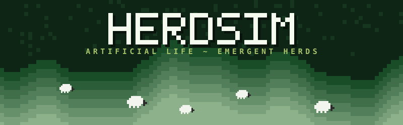
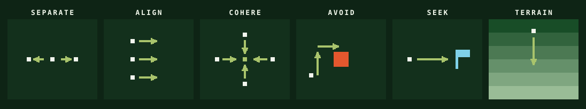
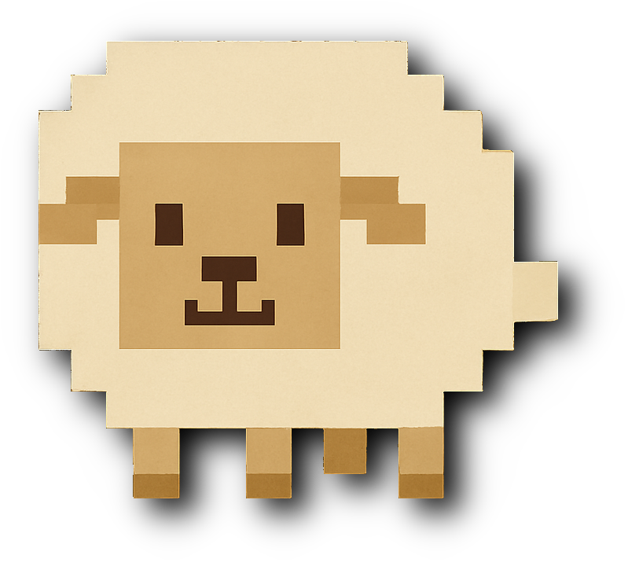
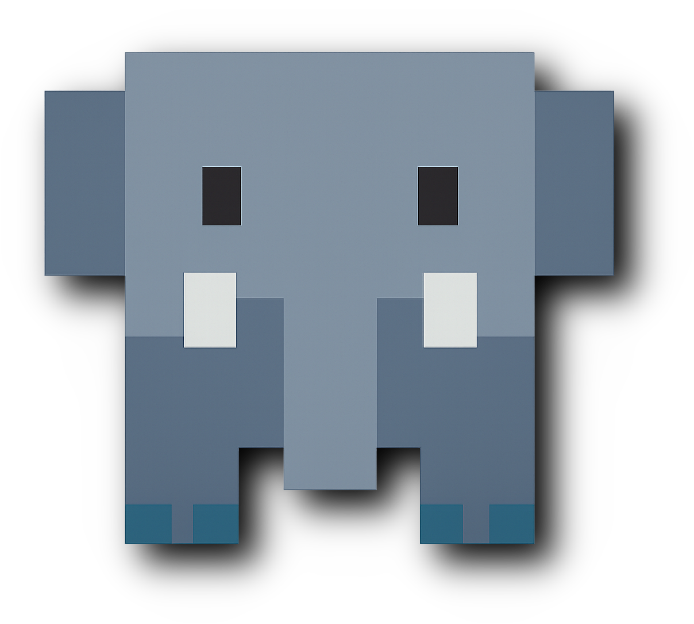
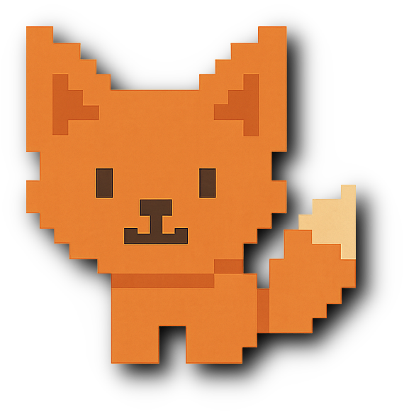
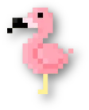
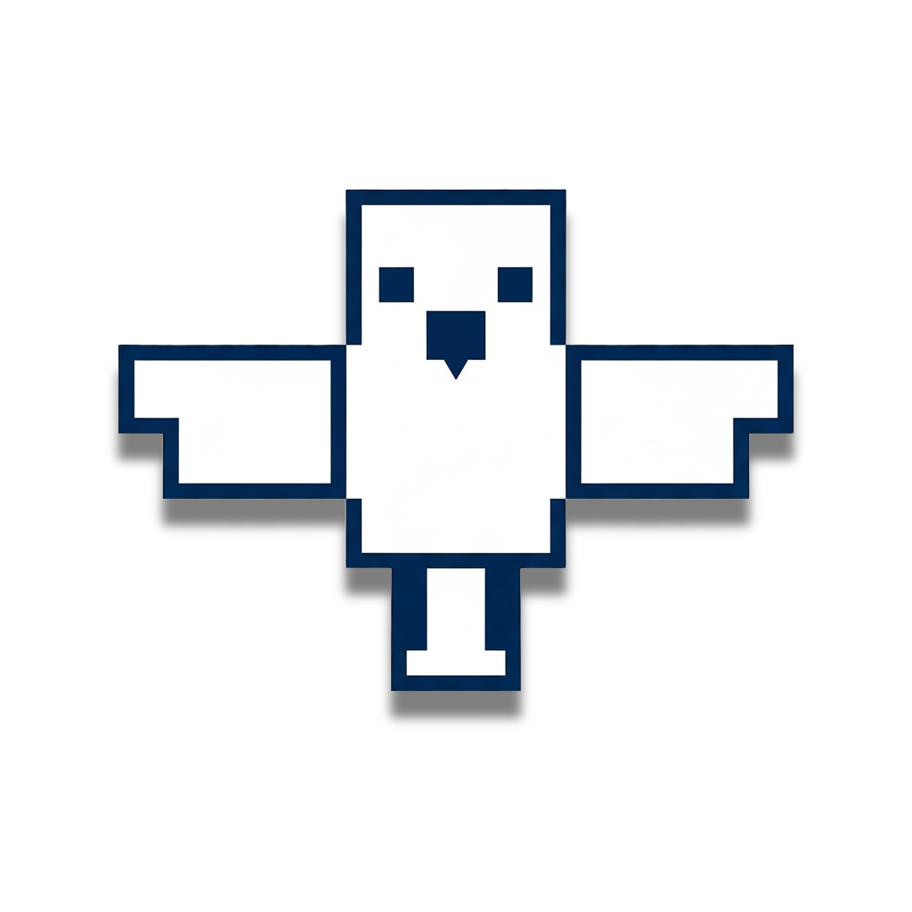
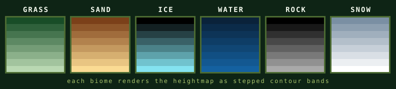

<div align="center">



<br/>


### An artificial-life sandbox where herds are never scripted, only *grown*.

**Six species. Six biomes. Zero choreography.**

Every animal is an autonomous agent running the same handful of steering rules against a
Newtonian force integrator and a real heightmap. Nobody tells the flock where to go.


</div>

---

## Contents

| Section | |
|---|---|
| [What HerdSim Actually Is](#-what-herdsim-actually-is) | the honest description |
| [The Six Rules](#-the-six-rules) | what every agent computes, every frame |
| [The Physics](#-the-physics) | forces, integration, terrain response |
| [Species Roster](#-species-roster) | six agents, six personalities |
| [The Terrain](#-the-terrain) | biomes as a physics layer |
| [Tutorial](#-tutorial-your-first-herd) | **start here** |
| [Controls](#-controls-reference) | every input, one table |
| [Install and Run](#-install-and-run) | getting it going |
| [Project Layout](#-project-layout) | where things live |

---

## 🧬 What HerdSim Actually Is

HerdSim is an **artificial-life simulator**: a real-time multi-agent system in which
flocking, foraging, panic and pursuit are *emergent*. They are never coded as behaviours,
only as consequences.

Let's be precise about the "AI", because the word is overloaded:

> **There is no machine learning here.** Nothing is trained, and there are no neural
> networks or weights. HerdSim sits in the older (and arguably more interesting) branch
> of AI: **rule-based artificial life**, the lineage of Reynolds' *Boids* (1987) and
> Conway's *Life*. Intelligence is not stored in a model; it is *produced*, frame by
> frame, by many simple agents reacting locally to one another and to the ground beneath
> them.

Each animal perceives only what falls inside its own view cone. It knows nothing about the
herd as a whole, has no map, and cannot see your cursor. Yet drop thirty sheep onto a
hillside and they will form a herd, round an obstacle as a body, break formation when a
fox commits to a chase, and re-form once it gives up.

That gap between *rules you can read in an afternoon* and *behaviour you did not
anticipate* is the entire point of the project.

---

## 🎯 The Six Rules

Every agent recomputes these each frame, sums them into one net force, and integrates.

<div align="center">

</div>

| Rule | Method | What it does |
|:--|:--|:--|
| **Separate** | `keepDistance()` | Push away from flockmates inside the **danger zone**; hold station at the **comfort zone**. Stops the herd collapsing to a point. |
| **Align** | `matchHeading()` | Steer toward the average heading of visible flockmates. This is what makes a herd *flow*. |
| **Cohere** | `steerToCenter()` | Pull toward the centre of mass of visible flockmates. Keeps stragglers attached. |
| **Avoid** | `avoidObstacles()` | Detect trees, boulders and bushes inside **obstacle-range** and steer around them. |
| **Seek** | `gotoGoal()` | If a waypoint exists for this species, bias toward it. A suggestion, not an order. |
| **Terrain** | `navigateTerrain()` | Read the local heightmap gradient and the biome underfoot, then apply the forces that ground demands. |

Crucially, an agent only counts a neighbour if it is **both** within `flockmate-range`
**and** inside `view-angle`. The blind spot behind an animal is real, and it is why herds
ripple rather than turn as one rigid block.

Two species break the base rules deliberately:

- **Swallow** overrides `navigateTerrain`, `avoidObstacles` and `computeNeighbours`. It
  *flies*. Terrain, obstacles and every other species are irrelevant to it.
- **Fox** adds `hunt()` on top of the six, driven by a hunger clock with target
  persistence, so it commits to one animal instead of flip-flopping between prey.

---

## ⚙️ The Physics

Forces accumulate; they are not applied one at a time.

```text
    netForce      =  Σ ( separate, align, cohere, avoid, seek, terrain, drag )

    acceleration  =  clamp( netForce / mass,  max-acceleration × modifier )
    velocity     +=  acceleration · dt
    velocity      =  clamp( velocity,  max-velocity )
    position     +=  velocity · dt
```

Two details do most of the character work:

- **`accelerationModifier`** sets how much grip a biome gives an animal. Ice sets it to
  `0.1`, so a sheep on ice keeps its momentum and cannot correct its course. It slides,
  because the physics says it must.
- **`drag-factor`** is a per-species resistance term. It is why an elephant (`30`) ploughs
  in a straight line while a fox (`7`) can switch direction almost instantly.

Time itself is a first-class control. The simulator records **every frame**, including all
agent states, obstacles, waypoints and terrain edits, so you can rewind, branch and replay.

---

## 🐑 Species Roster

<div align="center">

| | Species | Herd | Max Vel | Accel | View | Drag | Character |
|:--:|:--|:--:|:--:|:--:|:--:|:--:|:--|
|  | **Sheep** | 20 | 18 | 30 | 180° | 4 | Full panoramic vision, tight herds, poor swimmers. The baseline. |
|  | **Elephant** | 6 | 20 | 10 | 180° | 30 | Heavy and unhurried. Wide personal space, immense momentum. |
|  | **Fox** | 1 | 35 | 50 | 130° | 7 | **Predator.** Solitary, fastest accelerator, hunts on a hunger clock. |
|  | **Penguin** | 100 | 25 | 40 | 110° | 20 | Enormous colonies. Narrow vision makes for dense, jostling crowds. |
|  | **Flamingo** | 20 | 20 | 30 | 180° | 30 | Wades happily. High drag makes for slow, elegant drift. |
|  | **Swallow** | 15 | 30 | 100 | 120° | n/a | **Flies.** Ignores terrain, obstacles and every other species. |

</div>

Every one of these numbers is a live slider in the **Behaviour** tab. Change `view-angle`
on sheep from 180° to 40° and watch herds stop forming. They can no longer see each
other. The visualiser draws the affected range or arc on-canvas for ten seconds after any
change, so you can see exactly what you altered.

---

## 🏔️ The Terrain

A terrain is a **512×512 greyscale heightmap** quantised into stepped contour bands, then
painted in one of six biomes. The biome is not decoration. It is a physics layer.

<div align="center">

</div>

Each species answers the ground differently via `handleTerrainType()`. Taking **Sheep** as
the reference:

| Biome | Effect on a sheep |
|:--|:--|
| **Grass** | Baseline. Light drag (`1.5`). Full control. |
| **Sand** | Drag `12`, acceleration cut to `0.5`. Heavy going. |
| **Snow** | Drag `8`, acceleration `0.5`. Slow but steerable. |
| **Rock** | Drag `2`, acceleration `0.8`. Firm footing. |
| **Ice** | Acceleration `0.1`, so **almost no grip.** Momentum wins and sheep slide. |
| **Water** | *Slope-dependent.* Still water resists (`0.3` accel); **sloped water becomes a current** that pushes them downhill. |

That last row is the one worth playing with. Paint a river down a hillside and the water
will carry a herd away from where it wanted to go.

---

## 📖 Tutorial: Your First Herd

> **Goal:** get a herd flocking, put an obstacle in its path, send a fox after it, then
> rewind time and try a different world.

### ① Pick your world

Launch HerdSim. The **Terrain Loader** opens first.

- Use **◀ ▶** either side of the large preview to flip through saved terrains.
- The two smaller previews show the **neighbouring biomes**: the same landscape rendered
  as Sand, as Ice, as Water. Pick the biome you want to start in.
- Press **Start Simulation**.

*Want your own landscape?* Hit **Upload Heightmap** and choose any square PNG/JPG/TIFF.
Bright pixels become high ground. Non-512px images are rescaled for you, and the result is
saved into `terrain/` so it is there next time.

### ② Spawn a herd

Open the **Animals** tab.

1. Click a species. Start with **Sheep**.
2. Drag **Spawn Size** up to `10`.
3. **Left-click** on the canvas.

Ten sheep appear and immediately begin negotiating with each other. Click a few more times
in different spots and watch separate groups drift toward one another and merge.

### ③ Give them something to avoid

Open the **Terrain** tab, choose **Tree**, **Boulder** or **Bush**, then left-click on the
canvas. The obstacle is drawn using the icon matching the biome underneath it.

Now watch the herd meet it. They do not path around it. Each animal independently steers
away, and the *herd* flows around it as a consequence.

### ④ Reshape the ground

Still in the **Terrain** tab, pick a biome brush. Try **Ice**.

| Action | Result |
|:--|:--|
| **Scroll wheel** | Grow or shrink the brush (up to 200px) |
| Scroll to **zero** | Brush becomes a **bucket fill**, so a click floods a whole contour band |
| **Click and drag** | Paint continuously |
| **Square / Circle** | Switch brush shape |

Paint a sheet of ice across the herd's path. They will hit it and *slide*, because the
`accelerationModifier` of `0.1` strips their grip and momentum takes over.

### ⑤ Add a predator

Back to **Animals** → **Fox** → Spawn Size `1` → click near the herd.

The fox does not attack immediately; it hunts once its **hunger** rises past threshold.
When it commits, it locks onto a single sheep and keeps that target until the sheep dies
or breaks 200px away. The herd's response, the split, the panic, the re-forming, is all
emergent. None of it is scripted.

### ⑥ Steer without commanding

**Right-click** anywhere to drop a **waypoint** for the currently selected species.

It is a *bias*, not an order. The herd will drift toward it while still separating,
aligning, cohering and avoiding. Right-click again to clear it. Right-click with nothing
selected to clear every waypoint at once.

### ⑦ Bend time

The media bar records **every** frame: agents, obstacles, waypoints and terrain edits.

<div align="center">

**⏪ Rewind (x4)** · **◀ Rewind** · **⏸ Pause / Play** · **▶ Forward (x2)** · **⏩ Forward (x4)**

</div>

Rewind to before you painted that ice, then paint something else instead. The moment you
edit the past, the old future is discarded and a new branch begins from where you are.

### ⑧ Look closer

Hold **Ctrl** and scroll to zoom in on whatever is under the cursor, through `1x`, `1.5x`,
`2x`, `3x` and `4x`. Plain scrolling still resizes the brush, so the two never fight.

Hold **Space**, then click and drag to pan, the same gesture Figma uses. The view stays
clamped inside the terrain, and painting is suspended while space is held so you cannot
draw by accident.

Zoom is a property of the camera, not of the simulation, so rewinding never moves your
view. The brush is measured in terrain pixels, which means a 20px brush covers the same
ground at `4x` as it does at `1x`. It just looks bigger.

### ⑨ Choose the edge of the world

In the **Behaviour** tab, set what the boundary means:

| Mode | Behaviour |
|:--|:--|
| **Wrap** | Animals reappear on the opposite side |
| **Bounce** | Animals cannot cross the edge |
| **Follow** | Animals track along the edge |
| **Void** | Animals die at the edge |

---

## 🎮 Controls Reference

| Input | Context | Action |
|:--|:--|:--|
| **Left click** | Animal selected | Spawn `Spawn Size` animals |
| **Left click** | Obstacle selected | Place tree / boulder / bush |
| **Left click + drag** | Biome brush | Paint terrain continuously |
| **Left click** | Brush size `0` | Bucket-fill a contour band |
| **Right click** | Animal selected | Place / clear that species' waypoint |
| **Right click** | Nothing selected | Clear **all** waypoints |
| **Scroll wheel** | Brush or eraser | Resize brush `0 → 200` |
| **Ctrl + scroll** | Anywhere | Zoom about the cursor, `1x` to `4x` |
| **Space + click drag** | Anywhere | Pan the view |
| **Eraser + click** | Brush size `0` | Remove one obstacle or animal |
| **Eraser + drag** | Brush size `> 0` | Remove everything inside the brush |

---

## 🚀 Install and Run

```bash
git clone https://github.com/FabsOP/HerdingSim.git
cd HerdingSim

python -m venv venv
venv\Scripts\activate            # Windows
# source venv/bin/activate       # macOS / Linux

pip install -r requirements.txt

python run.py
```

Run the tests with `python -m pytest tests`.

**Requirements:** Python 3.9+, and Tk (bundled with python.org builds).
A prebuilt `HerdSim.exe` sits in the project root if you would rather just run it.

---

## 📁 Project Layout

```text
Code/
├── run.py                      launch this
├── requirements.txt
├── app.spec                    PyInstaller build spec
├── src/herdsim/
│   ├── app.py                  bootstrap and music scheduler
│   ├── core/
│   │   ├── boid.py             the agents: steering rules, species subclasses
│   │   ├── terrain.py          heightmaps, contour bands, biome physics
│   │   ├── flock.py            herd membership and size limits
│   │   └── vector.py           vector maths helpers
│   ├── ui/
│   │   ├── sim_canvas.py       render loop, painting, frame history, rewind
│   │   ├── camera.py           zoom level and viewport offset
│   │   ├── terrainLoader.py    startup terrain browser and heightmap upload
│   │   ├── simulation.py       main window
│   │   ├── controller.py       tab container
│   │   ├── animalTab.py        species picker and spawn size
│   │   ├── behaviourTab.py     live behaviour sliders
│   │   ├── terrainEditorTab.py brushes, obstacles, biomes
│   │   ├── borderHandler.py    edge-of-world modes
│   │   ├── media_controller.py transport controls
│   │   └── ui_utils.py         shared window helpers
│   └── utils/
│       └── path_utils.py       dev vs PyInstaller path resolution
├── assets/
│   ├── icons/                  sprites, per-biome obstacle art
│   ├── audio/music/            ambient soundtrack
│   ├── default_terrains/       bundled landscapes
│   └── readme/                 the diagrams on this page
├── heightmaps/                 source images to feed Upload Heightmap
├── tests/                      paint, rewind and camera regression tests
├── docs/                       design specs and plans
└── terrain/                    your terrains, created on first run, not in git
```

---

## 🙏 Credits

The terrain-following model comes from Joel Gompert's
[*Flocking Over 3D Terrain*](https://digitalcommons.unl.edu/cgi/viewcontent.cgi?article=1127&context=csetechreports)
(University of Nebraska-Lincoln, 2003). It extends
Craig Reynolds' *Flocks, Herds and Schools: A Distributed Behavioral Model* (SIGGRAPH
1987) with slope correction, energy expenditure and the drag forces that give each species
its weight.

Heightmaps can be sourced from
[manticorp's Unreal Heightmap Generator](https://manticorp.github.io/unrealheightmap/),
linked directly from the terrain loader.

---

## 📄 License

MIT. See [LICENSE](LICENSE). Use it, fork it, ship it.

<div align="center">
<br/>
<sub><b>The herd is not in the code. It happens anyway.</b></sub>
</div>
